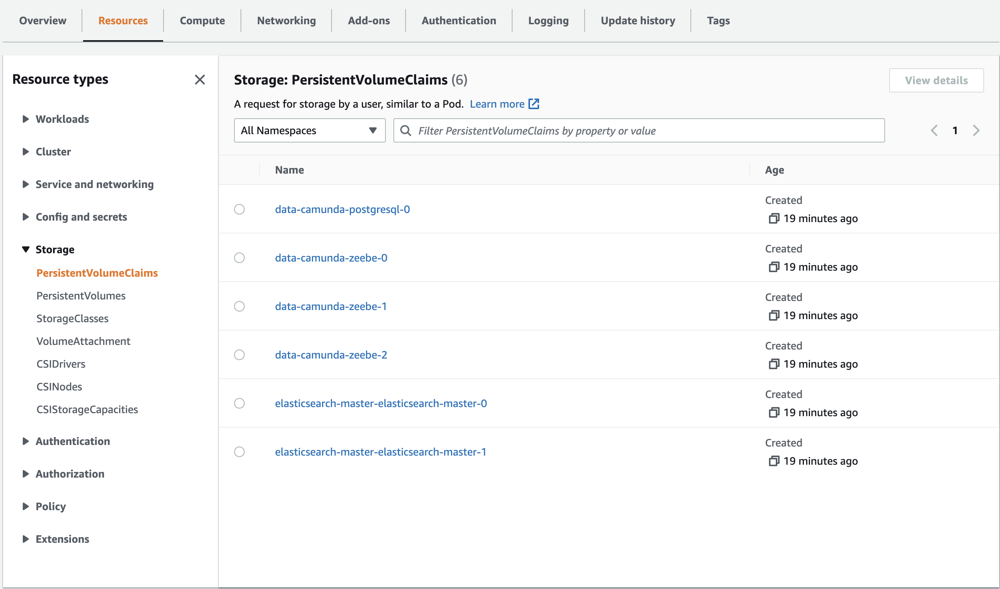
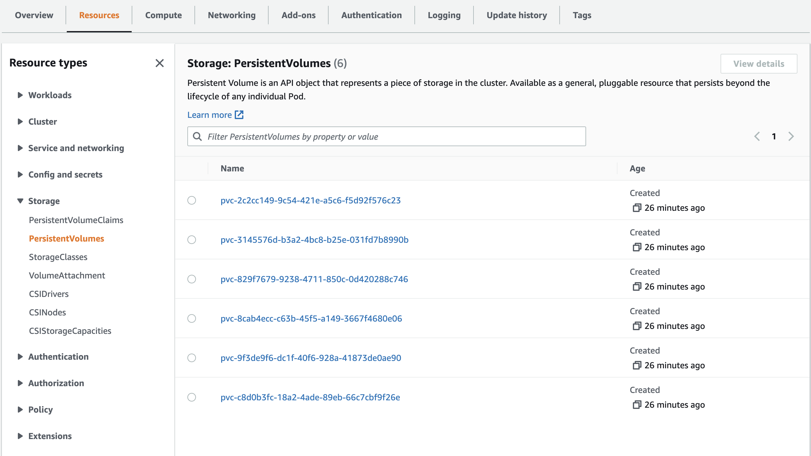
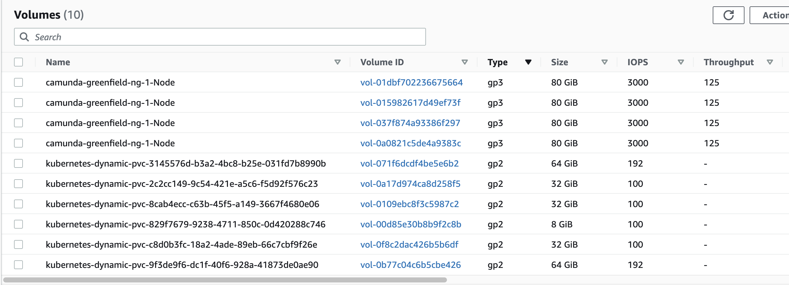

> :information_source: **Heads up!** Check out the [Camunda 8 Greenfield](https://github.com/camunda-community-hub/camunda8-greenfield-installation)
> repository for an easy way to quickly create and start a Camunda 8 Environment in AWS. After creating your kubernetes
> cluster, you'll be able to easily see the Persistent Volume Claims that are created by default
 
## Persistent Volumes and Persistent Volume Claims in AWS

This is a summary of persistence volumes that are created by default when using the Camunda Greenfield Project to create a Camunda environment in a AWS EKS cluster. 

Recommending which is the "best" type of storage to use is too complex to answer, especially since every environment has unique requirements. But hopefully the following notes will help shed some light on how many and which types of persistent volumes are created in order to help you design and plan for your specific installation.

### Storage Types/Class

By default, the Camunda Greenfield project uses this k8s storage class definition:

```shell
---
apiVersion: storage.k8s.io/v1
kind: StorageClass
metadata:
  name: ssd
provisioner: kubernetes.io/aws-ebs
reclaimPolicy: Delete
```

As a result, by default, [General Purpose 2 and 3 SSD](https://docs.aws.amazon.com/AWSEC2/latest/UserGuide/general-purpose.html) volumes are created 

### Camunda Related PVC's

When creating a Zeebe Kubernetes Environment based on the 
[helm charts](https://github.com/camunda/camunda-platform-helm), each 
`Zeebe` Broker will create a persistent volume claim along with a corresponding persistent volume,
for example, "data-camunda-zeebe-0". 

Each `elasticsearch` replica will also create a pvc and pv, for example:  
"elasticsearch-master-elasticsearch-master-0".

There is also a `data-camunda-postgresql-0` pvc created for `keycloak`.  

The screenshots below show the pvc's and pv's created in a cluster with 3 `zeebe` brokers and 2 `elasticsearch` nodes.

Here are the Persistent Volume Claims created: 



Here are the Persistent Volumes created (one volume for each claim above)



Here's a view from the EC2 / Volumes Admin Screen. I believe the three, 32GiB pvc volumes are the brokers, the 2 64GiB volumes are used by the elasticsearch nodes, and the [8GiB](https://github.com/helm/charts/tree/master/stable/postgresql) is used by postgresql which is used by keycloak: 



It's possible to control the following for zeebe brokers via `values.yaml` file: 

| Section | Parameter | Description | Default |
|-|-|-|-|
| | `pvcSize` | Defines the [persistent volume claim](https://kubernetes.io/docs/concepts/storage/persistent-volumes/#persistentvolumeclaims) size, which is used by each broker pod | `32Gi` |
| | `pvcAccessModes` | Can be used to configure the [persistent volume claim access mode](https://kubernetes.io/docs/concepts/storage/persistent-volumes/#access-modes) | `[ "ReadWriteOnce" ]` |
| | `pvcStorageClassName` | Can be used to set the storage class name which should be used by the persistent volume claim. It is recommended to use a storage class, which is backed with a SSD. | ` ` |

The `elasticsearch` volume claims can be customized as described [here](https://github.com/elastic/helm-charts/blob/main/elasticsearch/values.yaml). For example: 

     volumeClaimTemplate:
       accessModes: ["ReadWriteOnce"]
       resources:
         requests:
         storage: 64Gi

The Postgresql helm chart (which is used by Keycloak) defaults to use 8Gi as [described here](https://github.com/helm/charts/tree/master/stable/postgresql).