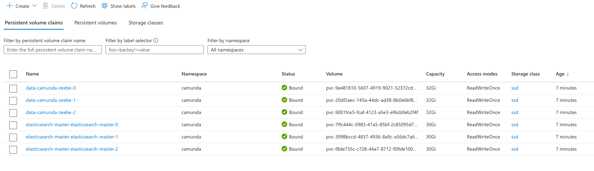
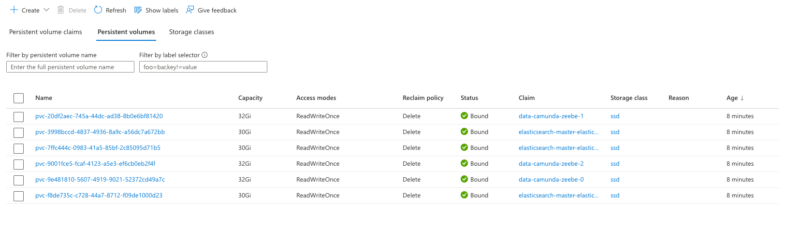

### Persistent Volumes and Persistent Volume Claims in Azure

When creating a Zeebe Kubernetes Environment based on the 
[helm charts](https://github.com/camunda/camunda-platform-helm), each 
`Zeebe` Broker will create a persistent volume claim along with a corresponding persistent volume,
for example, "data-camunda-zeebe-0". 

Each `elasticsearch` replica will also create a pvc and pv, for example:  
"elasticsearch-master-elasticsearch-master-0".

The screenshots below show the pvc's and pv's created in a cluster with 3 `zeebe` brokers and 3 `elasticsearch` pods.

Here are the Persistent Volume Claims created: 

Here are the Persistent Volumes created: 

It's possible to control the following for zeebe brokers via `values.yaml` file: 

| Section | Parameter | Description | Default |
|-|-|-|-|
| | `pvcSize` | Defines the [persistent volume claim](https://kubernetes.io/docs/concepts/storage/persistent-volumes/#persistentvolumeclaims) size, which is used by each broker pod | `32Gi` |
| | `pvcAccessModes` | Can be used to configure the [persistent volume claim access mode](https://kubernetes.io/docs/concepts/storage/persistent-volumes/#access-modes) | `[ "ReadWriteOnce" ]` |
| | `pvcStorageClassName` | Can be used to set the storage class name which should be used by the persistent volume claim. It is recommended to use a storage class, which is backed with a SSD. | ` ` |

And, `elasticsearch` volume claims can be customized as described [here](https://github.com/elastic/helm-charts/blob/main/elasticsearch/values.yaml). For example: 

     volumeClaimTemplate:
       accessModes: ["ReadWriteOnce"]
       resources:
         requests:
         storage: 30Gi