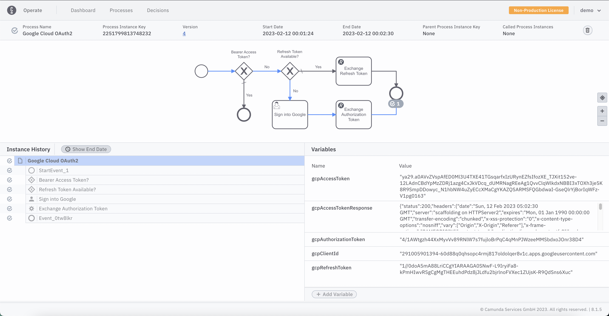

# Sign in with Google OAuth2


This is a sample Camunda 8 Platform BPM Process that does the OAuth2 handshake to obtain an Access Bearer Token for Google Cloud APIs.

The purpose of this process is to produce a valid OAuth2 Bearer Access Token that can then be used to make GCP API Calls on behalf of a person.  



# Usage

This process requires 2 things to be defined beforehand: 

1. Google Cloud OAuth2 Client Id passed as a process instance variable
2. Google Cloud OAuth2 Client Secret, defined as `secrets.GCP_OAUTH2_CLIENT_SECRET`

The `OAuth2 Client Id` must be passed to start a process instance, for example: 

```json
{
  "gcpClientId": "<YOUR GCP OAUTH2 CLIENT ID>",
  "gcpAccessToken": null, // This is optional, if passed, the process returns immediately
  "gcpRefreshToken": null // This is optional, if passed, the refersh token is traded for an access token
}
```

The `OAuth2 Client Secret` must be set inside a Connector Secret named `secrets.GCP_OAUTH2_CLIENT_SECRET`.

If neither refresh token nor access token are present at the start of the process, then a person will need to sign into 
Task List and follow the directions on the form to manually sign in with Google, allow access, and copy the authorization code. 

If you already have done that step and saved the refresh token, then you can pass that at process start as well. This will 
skip the need to have a user manually sign in. 


