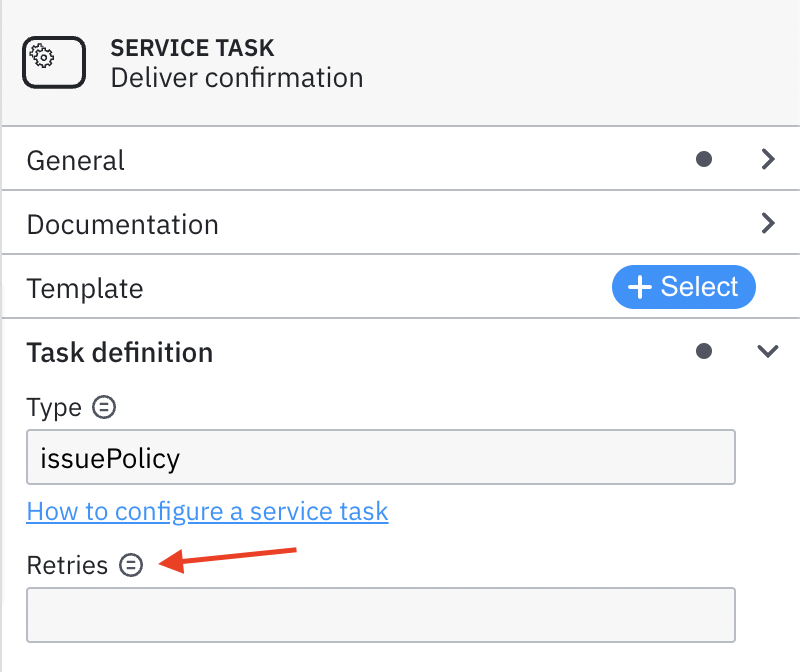
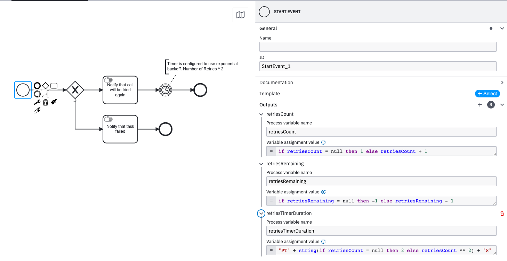
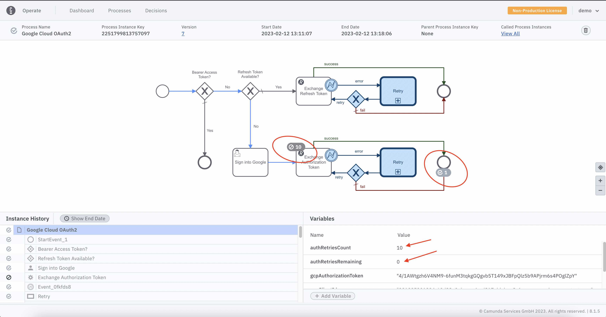
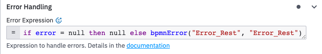
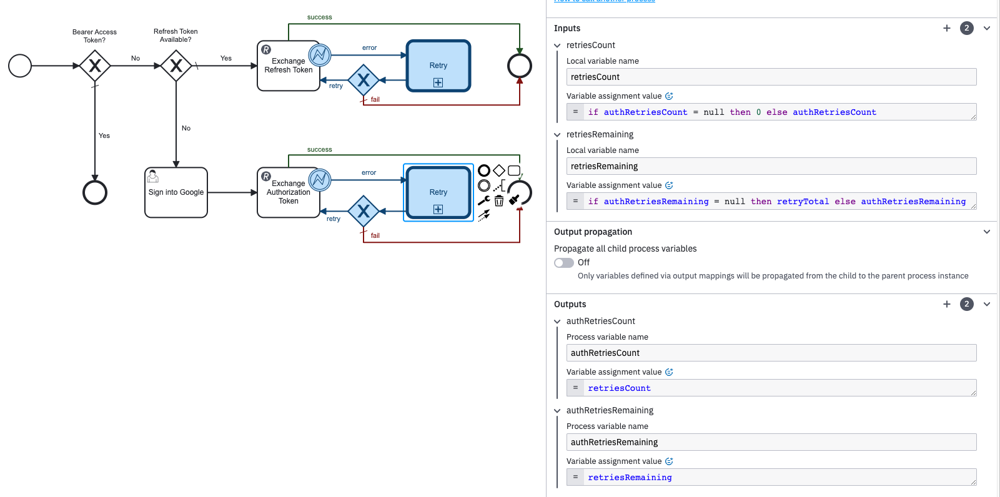

# Retrying to Recover from Business Errors 

You might have noticed that Camunda Platform 8 [Service Tasks](https://docs.camunda.io/docs/components/modeler/bpmn/service-tasks/) allow setting number of `retries` as shown here.  

However, the [Rest Connector](https://docs.camunda.io/docs/components/connectors/out-of-the-box-connectors/rest/) hides this setting? This is a deep dive into why that's the case. 

# Technical Errors vs Business Errors 

The [retries](https://docs.camunda.io/docs/components/best-practices/development/dealing-with-problems-and-exceptions/#handling-exceptions-on-a-technical-level) feature available in Service Tasks is meant to handle unexpected, [tecnical](https://docs.camunda.io/docs/components/modeler/bpmn/error-events/#business-error-vs-technical-error), Job Worker related errors.     

[Connectors](https://docs.camunda.io/docs/components/connectors/introduction-to-connectors/), on the other hand, provide a less technical, more business friendly interface. Business folks usually don't need (or want) to have to understand, for example, the implementation details of how Zeebe Job Workers are [requesting jobs](https://docs.camunda.io/docs/components/concepts/job-workers/#requesting-jobs) from the Zeebe Engine.

So, these types of lower level technical details are hidden and managed internally by the Connector Runtime. Of course, if you need this level of control, it's still possible to write your own [Job Worker](https://docs.camunda.io/docs/guides/orchestrate-microservices/#create-a-worker-for-the-service-task) or [Custom Connector](https://docs.camunda.io/docs/components/connectors/custom-built-connectors/connector-templates/).  

# Business Retry Example

Connectors provide a way to model business errors [described here](https://docs.camunda.io/docs/components/connectors/use-connectors/#bpmn-errors)

Here's a more advanced example of one possible strategy for modeling exponential backoff retries for a Rest Connector Task. 

The [RetryBusinessError.bpm](../gcp-oauth2-signin/RetryBusinessError.bpmn) is an example that can be easily reused as a call activity or subprocess. 

There are 2 inputs: `retriesCount` and `retriesRemaining`. 

If `retriesRemaining` is greater or equal to 0, then a notification is sent that we are attempting to retry the operation. The timer is set based on the number of retries attempted so far. If this is the 4th retry, the timer will wait for 16 seconds (4^2). 

When `retriesRemaining` is less than 0, a notification is sent that the operation failed.

This can be easily reused from a parent process whenever necessary to retry a Rest Connector Task. For example, when the `Exchange Authorization Token` Rest Task inside the [GoogleCloudOauth.bpmn](../gcp-oauth2-signin/GoogleCloudOAuth.bpmn) process, shown below, receives a http response with an error code, an [error boundary event](https://docs.camunda.io/docs/components/best-practices/modeling/modeling-beyond-the-happy-path/#dealing-with-errors) triggers the [RetryBusinessError.bpmn](../gcp-oauth2-signin/RetryBusinessError.bpmn) as a call activity. Notice that in this example, it retries 10 times. Each retry, the timer waits slightly longer (`authRetriesCount` ^ 2) than the last retry, before finally decrementing the `authRetriesRemaining`. 

Notice that the `Exchange Authorization Token` Rest Connector Task has the Error Handling configured to throw a `bpmnError` of type `Error_Rest`. The error boundary event is configured to trigger for any `Error_Rest` errors.   

The Call Activity maps parent process instance variables to the corresponding child process intance variables. This way, the parent process can monitor the state and knows when to give up and stop retrying. 

## Note

[This section](https://docs.camunda.io/docs/components/best-practices/development/dealing-with-problems-and-exceptions/#business-vs-technical-errors) of the Camunda Documentation mentions the following: 

> Retrying. You don't want to model the retrying, as you would have to add it to each and every service task. This will bloat the visual model and confuse business personnel. Instead, either retry or fall back to incidents as described above. This is hidden in the visual.

I think this is a grey area. In some cases, I agree, this might be unnecessary bloat. However, in certain use cases, it can be perfectly reasonable to explicitly model a retry pattern. I think the pattern shown here is a legitimate possibility for times when business requires Rest Connector Retries. 

